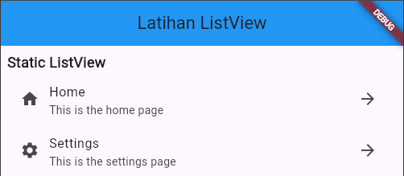
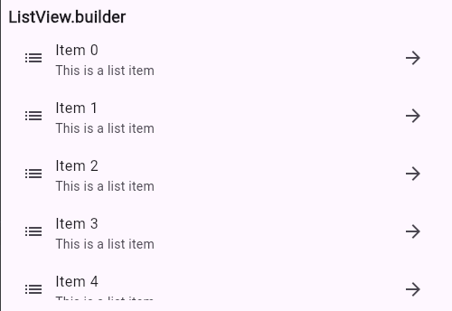
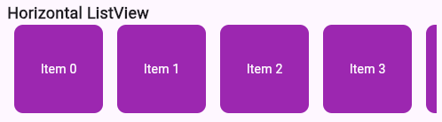
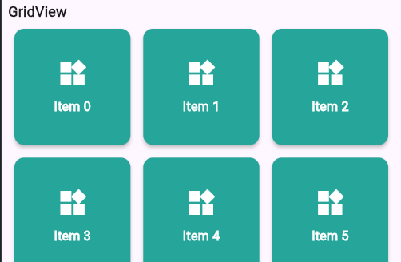

# Latihan Modul 1 : Layout dan Navigation

Setiap Latihan memiliki **3 tugas (TODO)** yang bisa dikerjakan.

Gunakan pengetahuan yang telah Anda peroleh selama belajar di kelas praktikum dan tunjukkan kemampuan Anda dalam menguasai materi.

### TODO 1

Buatlah ListView menggunakah `ListView Sederhana` dengan isi atribut widget pada masing-masing `ListTile` seperti berikut :

`ListTile` ke 1 
```bash
leading: const Icon(Icons.home),
title: const Text('Home'),
subtitle: const Text('This is the home page'),
trailing: const Icon(Icons.arrow_forward),
```

`ListTile` ke 2
```bash
leading: const Icon(Icons.settings),
title: const Text('Settings'),
subtitle: const Text('This is the settings page'),
trailing: const Icon(Icons.arrow_forward),
```

sehingga hasilnya seperti berikut :



### TODO 2

Buatlah ListView menggunakah `ListView.builder()` dengan jumlah `itemCount: 20` dan atribut widget pada `ListTile` seperti berikut :

`ListTile`
```bash 
leading: const Icon(Icons.list),
title: Text('Item $index'),
subtitle: const Text('This is a list item'),
trailing: const Icon(Icons.arrow_forward),
```

sehingga hasilnya seperti berikut :



### TODO 3

Buatlah ListView menggunakan `ListView Horizontal` dengan `builder` dan return seperti berikut :

```bash
return Container(
  width: 100,
  margin: const EdgeInsets.symmetric(horizontal: 8),
  decoration: BoxDecoration(
    color: Colors.purple,
    borderRadius: BorderRadius.circular(10),
  ),
  child: Center(
    child: Text(
      'Item $index',
      style: const TextStyle(color: Colors.white),
    ),
  ),
);
```

sehingga hasilnya seperti berikut :



### TODO 4

Buatlah `GridView.count()` dengan atribut seperti berikut :

```bash
crossAxisCount: 3,
physics: const NeverScrollableScrollPhysics(),
children: List.generate(6, (index) {
  return Card(
    color: Colors.teal[400],
    elevation: 4,
    margin: const EdgeInsets.all(8),
    shape: RoundedRectangleBorder(
      borderRadius: BorderRadius.circular(12),
    ),
    child: Center(
      child: Column(
        mainAxisAlignment: MainAxisAlignment.center,
        children: [
          Icon(Icons.widgets, size: 40, color: Colors.white),
          const SizedBox(height: 10),
          Text(
            'Item $index',
            style: const TextStyle(
              color: Colors.white,
              fontSize: 16,
              fontWeight: FontWeight.w600,
            ),
          ),
        ],
      ),
    ),
  );
}),
```

sehingga hasilnya seperti berikut :



#### TODO 5

Tambahkan `Navigation.push()` dan `Navigation.pop()` pada kode yang sudah ditandai dan hubungkan antara [LayoutPage](lib/latihan_layout.dart) dengan [NavigationPage](lib/latihan_navigation.dart)